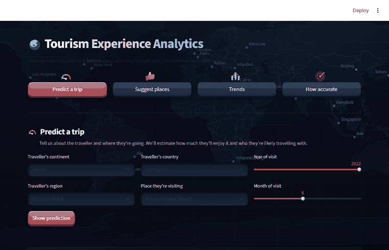

# Tourism Experience Analytics

[](LICENSE)


Classification, prediction, and recommendation on a tourism dataset (9 linked
tables, 52,930 visit transactions). Ships an end-to-end pipeline + Streamlit app.



<sub>Demo: predicting a trip, then browsing suggestions, trends, and accuracy. Static screenshot: [docs/app.png](docs/app.png).</sub>

## Summary

A tourism analytics tool that turns raw visit records into three decisions a travel
platform or agency actually cares about: **how much a traveller will enjoy a place,
who they'll travel with, and where to send them next.**

The dataset is 52,930 visits by 33,530 users across 30 attractions, spread over 9
linked tables (transactions, users, attractions, and geography/type lookups). The
pipeline cleans and merges them into one master table, then trains three models —
a **rating regressor**, a **visit-mode classifier**, and an **attraction
recommender** — and serves everything through a Streamlit app with four tabs:

- **Predict a trip** — a traveller profile + destination → predicted rating (1–5 stars)
  and most-likely travel style (Business / Couples / Family / Friends / Solo), with a
  probability breakdown.
- **Suggest places** — attractions to visit next, from a place they loved, a specific
  traveller's history, or crowd favourites.
- **Trends** — dashboards on who travels, where they come from, top-rated place types,
  and visits per year.
- **How accurate** — plain-language honesty check on the models' held-out performance.

**Business value:** flag likely low-rated visits before they hurt reviews, target
marketing to the predicted travel style, lift engagement with personalised
recommendations, and read tourism hotspots and trends at a glance.

## Run it

```bash
pip install -r requirements.txt
python src/data_prep.py     # clean + merge 9 tables  -> data/master.parquet
python src/eda.py           # visualizations          -> reports/figures/
python src/models.py        # regression + classification, model comparison -> artifacts/
python src/recommend.py     # collaborative + content-based -> artifacts/recsys.joblib
python src/eval_recsys.py   # recsys RMSE + MAP/Precision@10 -> metrics.json
streamlit run app.py        # the app
```

`data/` holds the raw Excel tables (download from the source Drive folder if missing).

## What each objective does

**1. Regression — predict a user's attraction rating (1–5).**
Features: user geography ids, visit year/month, attraction id/type/city, plus
leakage-safe train-only mean encodings (`attr_avg_rating`, `user_avg_rating`).
Compared LinearRegression / RandomForest / XGBoost.

| model | R² | RMSE | MAE |
|---|---|---|---|
| Linear | -0.069 | 1.003 | 0.734 |
| RandomForest | -0.077 | 1.007 | 0.733 |
| **XGBoost (best)** | **-0.040** | **0.990** | **0.719** |

Ratings are heavily skewed toward 4–5, so they are close to unpredictable from
the available features — R² near zero is the honest result, not a bug. MAE ≈ 0.72
means predictions land within ~0.7 stars.

**2. Classification — predict visit mode (Business / Couples / Family / Friends / Solo).**
Class-imbalanced (Couples 21.6k vs Business 623), so models use balanced class
weights. Compared LogisticRegression / RandomForest / XGBoost.

| model | accuracy | F1 (weighted) |
|---|---|---|
| Logistic | 0.271 | 0.287 |
| RandomForest (depth-capped) | 0.416 | 0.428 |
| **XGBoost (best F1)** | **0.496** | **0.449** |

Best model picked by weighted F1 (XGBoost) since accuracy alone rewards the majority
class. The RandomForest is depth-capped (`max_depth=16`, `min_samples_leaf=5`) so the
saved model is a few MB instead of ~1.1 GB — this made XGBoost the F1 leader and keeps
app cold-start to ~1 s. Confusion matrix in `artifacts/confusion_matrix.png`.

**3. Recommendation — attraction suggestions.**
- Collaborative: item-item cosine similarity on the user×attraction rating matrix.
- Content-based: TF-IDF over attraction name + type + city.
- Per-user hybrid: aggregate CF neighbours of a user's visited attractions.
- Cold-start fallback: most-popular by average rating.

Evaluation ([src/eval_recsys.py](src/eval_recsys.py)): rating **RMSE 1.02** (item-item CF),
ranking **MAP@10 0.34**, **Precision@10 0.07**, **HitRate@10 0.62** — for ~62% of users
a genuinely-visited attraction lands in the top-10 built from their history.

## Layout

```
src/data_prep.py   build master dataframe
src/eda.py         EDA figures
src/models.py      train/compare + save best models, metrics.json
src/recommend.py   recsys artifacts + inference helpers (imported by app)
src/eval_recsys.py recommender RMSE + MAP/Precision@10 -> metrics.json
app.py             Streamlit: Predict a trip / Suggest places / Trends / How accurate
assets/            world map (Natural Earth) for the app background
artifacts/         saved models, metrics, plots
reports/figures/   EDA plots
```

## Notes / deliberate simplifications
- Tree models consume raw category ids directly (no one-hot) — fewer moving parts,
  same accuracy on trees.
- Only 30 of 1,698 catalogued attractions actually appear in transactions, so
  collaborative filtering operates over those 30.
